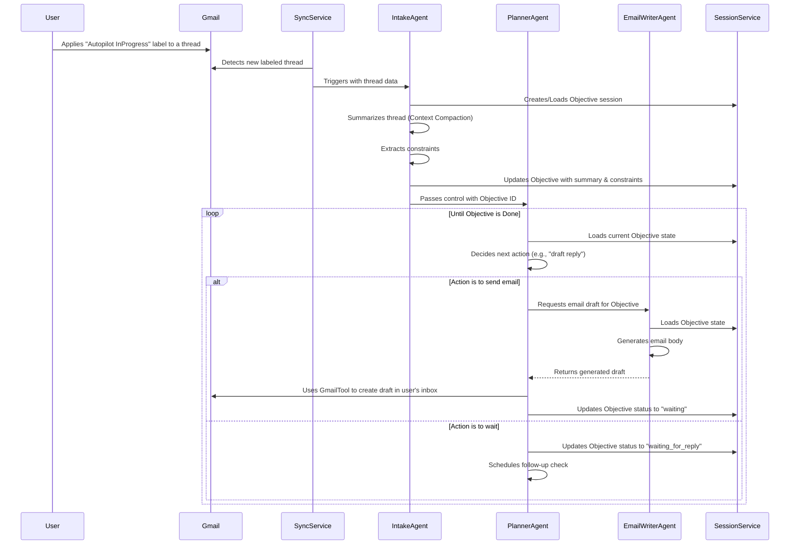

# E-Mail Dog: System Architecture

This document provides a high-level overview of the E-Mail Dog system architecture, including data models, agent interactions, and the overall workflow.

## 1. Core Components

The system is designed around a few key components as outlined in the `tech-decisions.md` document:

- **Agents**: The core logic units responsible for reasoning and acting.
    - `IntakeAgent`: Processes incoming emails and objectives.
    - `PlannerAgent`: Decides the next action.
    - `EmailWriterAgent`: Composes email drafts.
- **Tools**: Functions that agents can call to interact with the outside world.
    - `GmailTool`: Interacts with the Gmail API.
    - `SchedulerTool`: Manages follow-ups.
    - `SummarizerTool`: Performs context compaction.
- **Services**: Backend components that manage state and data.
    - `SessionService`: Manages the state of each objective.
    - `MemoryService`: Provides long-term memory capabilities.
- **Data Models**: The structures that represent the system's data.

## 2. Data Models (Pydantic Schemas)

We will use Pydantic for clear, type-hinted data models.

```python
from pydantic import BaseModel, Field
from typing import List, Optional
from datetime import datetime

class Objective(BaseModel):
    id: str = Field(..., description="Unique identifier for the objective.")
    user_query: str = Field(..., description="The user's original natural language objective.")
    status: str = Field(default="pending", description="Current status: pending, in_progress, waiting, done, error.")
    linked_thread_ids: List[str] = Field(..., description="List of Gmail thread IDs associated with this objective.")
    summary: Optional[str] = Field(None, description="A compact summary of the conversation.")
    constraints: dict = Field(default_factory=dict, description="Structured constraints extracted from the query (e.g., dates, names).")
    history: List[str] = Field(default_factory=list, description="Log of actions taken for this objective.")
    last_action_time: Optional[datetime] = Field(None, description="Timestamp of the last action taken.")

class Email(BaseModel):
    id: str
    thread_id: str
    sender: str
    snippet: str
    body: str
```

## 3. Agent Interaction Workflow (Sequence Diagram)

This diagram illustrates the typical flow of an operation.



## 4. Directory Structure

The project will be organized as follows to separate concerns:

```
/email-dog
|-- main.py
|-- agents/
|   |-- __init__.py
|   |-- base.py
|   |-- intake.py
|   |-- planner.py
|   |-- writer.py
|-- tools/
|   |-- __init__.py
|   |-- gmail.py
|   |-- scheduler.py
|-- services/
|   |-- __init__.py
|   |-- session.py
|   |-- memory.py
|-- tests/
|   |-- __init__.py
|   |-- test_intake_agent.py
|   |-- test_planner_agent.py
|-- docs/
|-- requirements.txt
|-- README.md
```
